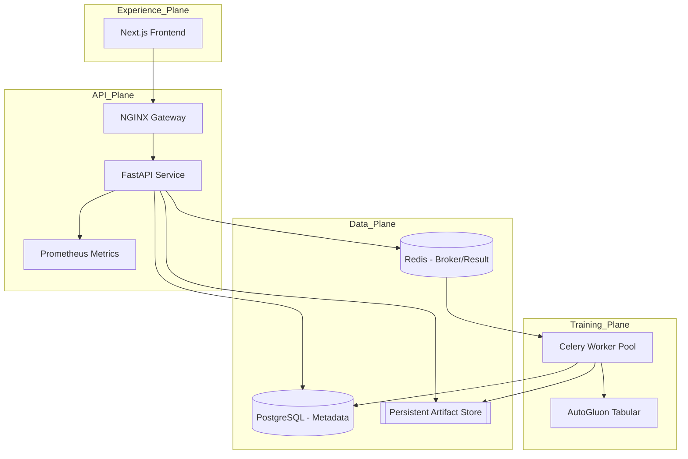

# No-Code ML Platform (Enterprise Reference)

[](https://github.com/your-org/nocodeml/actions/workflows/ci.yml)
[](https://opensource.org/licenses/MIT)

A production-grade, cloud-native Machine Learning platform demonstrating senior-level engineering principles in **asynchronous system design**, **MLOps automation**, and **Kubernetes orchestration**.

This repository serves as a reference implementation for a scalable, self-service ML infrastructure, prioritizing architectural separation, operational observability, and deterministic delivery.

---

## 🏗️ System Architecture

The platform is architected around a **Decoupled Control & Data Plane** model, ensuring that long-running training workloads never impact API responsiveness or system stability.



### Architectural Highlights

*   **Asynchronous Execution Pattern:** Training jobs are offloaded to a dedicated worker pool via Redis, preventing head-of-line blocking on the API.
*   **Hybrid Metadata Strategy:** Combines the ACID guarantees of PostgreSQL for job state with a redundant JSON file-based registry for artifact provenance and disaster recovery.
*   **Deterministic Environments:** Leverages `uv` for Python and `Bun` for Node.js to ensure bit-for-bit parity between local development and production OCI images.
*   **Infrastructure-as-Code (IaC) Ready:** Includes comprehensive Kubernetes manifests with HPA, PodDisruptionBudgets, and fine-grained NetworkPolicies.

---

## 🛠️ Tech Stack & Engineering Standards

*   **Backend:** Python 3.12, FastAPI (Async), SQLAlchemy 2.0 (Typed), Alembic (Migrations), Celery 5.5.
*   **ML Engine:** AutoGluon Tabular (Multi-modal ensemble learning).
*   **Frontend:** Next.js 16 (App Router), React 19, TypeScript, Tailwind CSS 4.
*   **Infrastructure:** PostgreSQL 16, Redis 7, NGINX, Docker, Kubernetes.
*   **Standards:** Non-root execution, RFC-compliant health probes, Prometheus instrumentation, and strict type safety.

---

## 🚀 Quickstart: Local Development

The project uses a unified `Makefile` to abstract environment complexities.

### Prerequisites
* Python 3.12+ & `uv`
* Node.js & `bun`
* Docker (for service-backed development)

### 1. Bootstrap Services
```bash
docker compose up -d postgres redis
```

### 2. Initialize Backend
```bash
make backend-sync        # Install dependencies via uv
make backend-db-upgrade  # Run Alembic migrations
```

### 3. Launch Services
| Component | Command | Endpoint |
| :--- | :--- | :--- |
| **API** | `make backend-serve` | [localhost:8000/docs](http://localhost:8000/docs) |
| **Worker** | `make backend-worker` | N/A (Logs to stdout) |
| **Frontend** | `make frontend-dev` | [localhost:3000](http://localhost:3000) |

---

## ☸️ Cloud-Native Deployment

The platform is designed for high-availability deployment on Kubernetes.

### Production Readiness Features
*   **Horizontal Scaling:** Independent HPA configurations for API and Training planes.
*   **Security Hardening:** Pods run as `non-root`, drop all Linux capabilities, and use `readOnlyRootFilesystem` where applicable.
*   **Zero-Downtime Rollouts:** Configured with `RollingUpdate` strategies and readiness/liveness/startup probes.
*   **Network Isolation:** Strict K8s `NetworkPolicies` restrict traffic between planes (e.g., Frontend cannot talk to PostgreSQL directly).

### Deploy to Cluster
```bash
# 1. Apply base manifests
kubectl apply -k infra/k8s/base

# 2. (Optional) Enable GPU training
kubectl apply -k infra/k8s/overlays/gpu-worker
```

---

## 📖 Deep Dive Documentation

For detailed insights into specific engineering domains:

*   **[Architecture Design](./docs/ARCHITECTURE.md)**: Rationale, failure modes, and scalability targets.
*   **[Operations & SRE Runbook](./docs/OPERATIONS.md)**: Health monitoring, metrics, and incident response.
*   **[Release Governance](./docs/RELEASE_CHECKLIST.md)**: Quality gates and rollout procedures.
*   **[Security & RBAC](./docs/ROLE_MATRIX.md)**: Permission models and access control.

---

## 🤝 Contributing

We maintain high standards for code quality and testing. Please review [CONTRIBUTING.md](./CONTRIBUTING.md) before submitting a Pull Request.
